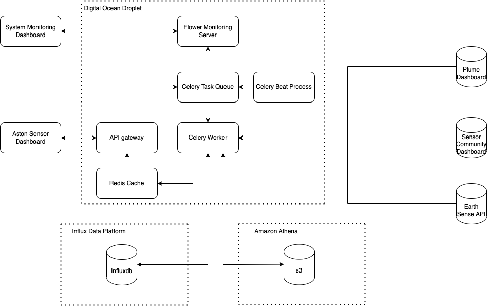

# AirQualitySensors

## Deployment Of Testing Environment

1. Ensure [Docker](https://www.docker.com/) is installed
2. Clone the repo
3. Navigate to the project root in a terminal window
4. Run the command ```docker compose -f docker-compose-test-env.yml up -d```
5. Wait until Docker builds and deploys containers.

## Usage

- Either ```plume```, ```zephyr``` or ```sensor_community``` buckets can be queried through the API end point available
  on ```http://0.0.0.0:8000```

1. POST ```http://0.0.0.0:8000/api/tasks/create/{sensor}```, where ```{sensor}``` is one of the above-mentioned buckets,
   include a ```start``` and ```end``` timestamp in the request payload
2. A task id will be returned in the following json format; ```{"task_id": "xxxxxxxx-xxxx-xxxx-xxxx-xxxxxxxxxxxx"}```
3. GET ```http://0.0.0.0:8000/api/tasks/{task_id}``` where ```task_id``` is the task id returned from the previous
   POST
4. A status and result will be returned in the following json
   format; ```{"task_id": "xxxxxxxx-xxxx-xxxx-xxxx-xxxxxxxxxxxx", "task_status": {status}, task_result: {task_result}}```
5. The ```{status}``` will either be ```SUCESS```, ```PENDING``` or ```FAILED```
6. If ```PENDING``` the GET can be re-requested to check the status until the back end task reports a success or failure
7. ```{task_result}```will be populated when the task succeeds in the following json
   format; ```[{"sensor_id": {sensor_id}, "header": {header}, "rows": [rows]}]```

## Administration

- Flower monitoring server available on ```http://0.0.0.0:8888```
- Influx DB available on ```http://0.0.0.0:8086```

## Architecture

